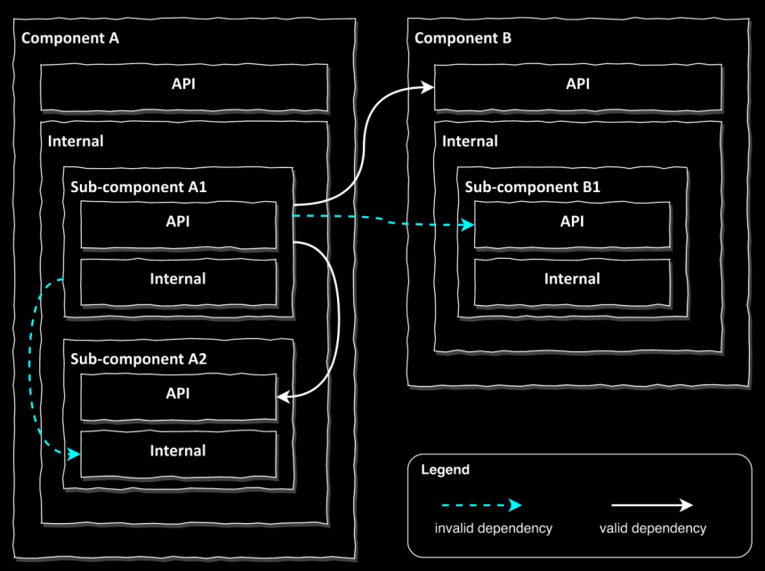
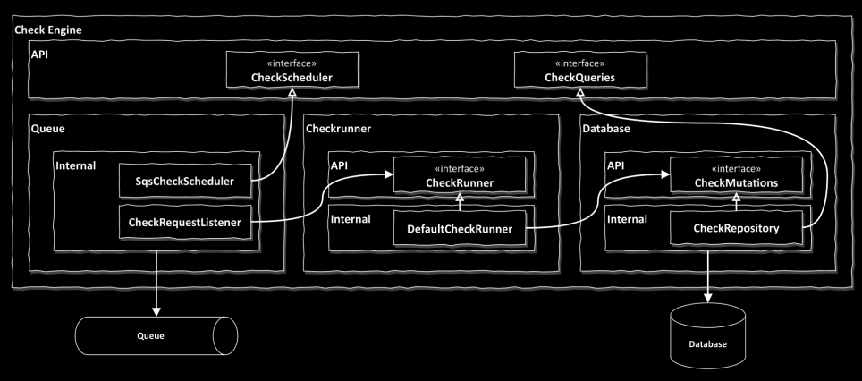
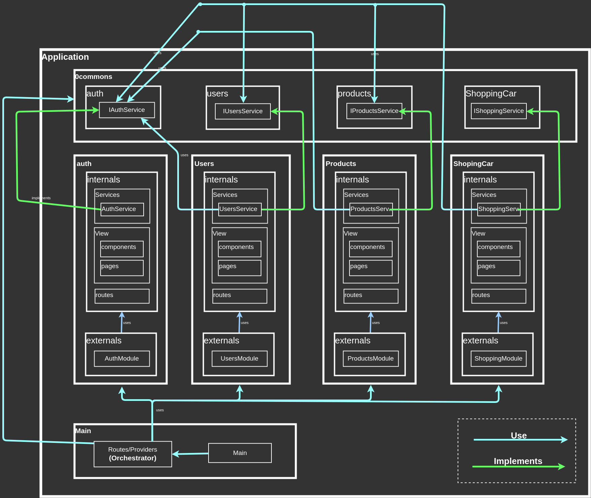

# FrontEnd

This is a template for future projects with an architecture in modules, mainly
based on the following books, ordered by priority:

1. Get Your Hands Dirty on Clean Architecture by Tom Hombergs
2. Learning Angular: A no-nonsense guide to building web applications with Angular by Aristeidis and Pablo
3. Clean Code by Robert C. Martin
4. Code That Fits in Your Head by C. Martin

## Why I choose Angular

**DI and CoI**: Dependency Injection (DI) makes it easier to apply the Inversion
of Control (IoC), simplifying the management of dependencies between classes
and modules. With TypeScript, these dependencies can exist solely between interfaces.

**Modules**: Angular provides an official and well-defined way to manage modules,
making it easier to create loosely coupled code and establish a common workflow
for the team. In the end, a module only needs to be plugged in via its routes
and implement the interfaces required by other modules.

**Reuse of Knowledge**: As an object-oriented programmer, over time, one gets
used to the mental model of objects and their relationships. This same model
can be applied in Java, C#, TypeScript, C++, Spring, Android, etc. Using
frameworks that are similar to each other reduces the learning curve and
allows programmers to take greater advantage of their existing experience.

**Maturity**: Even though there are more performant and modern frameworks out
there, the inertia of Angular and React can't be ignored. Many projects have
already been started with these frameworks, and developers have already learned
them. These projects can't simply be rewritten or relearned just to do the same
things with different tools. What’s more important is to extend and refactor
existing projects, build more client features, and master the tools we
already know.

## How it works the modularity through components

The same as was described in the book *Get Your Hands Dirty on Clean Architecture by Tom Hombergs*
in the chapter *modularity through components* the where here can see the basic
principles.

Here a more specific example.

The important thing here is to always keep in mind what the modules can and
cannot expose. If there is a dependency between modules, it should only happen
through interfaces stored in another public module component space or at a
higher level of the module.

Because the book is based on how Java Spring works, I have made a few small
adjustments in this application to better align with the way Angular works.

- Instead of using the package/folder name "api," I use "externals" because
  I believe it is more expressive for someone without context or background,
  making the intended use of this type of architecture clearer.

- The whole application works similarly to a component, but instead of calling
  it externals, I call it 0commons. This serves as an intermediate layer for
  dependencies. In other words, instead of components depending on each other,
  they depend on 0commons, making relationships less complex and easier to
  understand.

Here is part of the object relation diagram (some parts are finished, others
are pending) of this app to show a summary of the organization of the
architecture. Other modules should follow the same structure.

